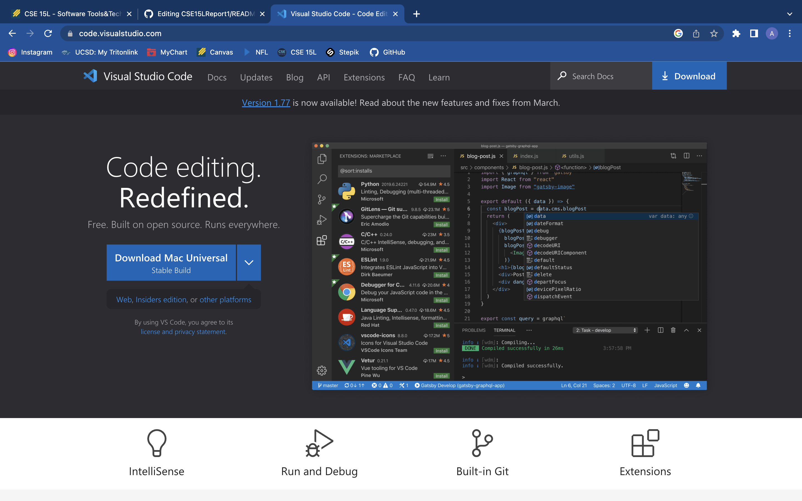
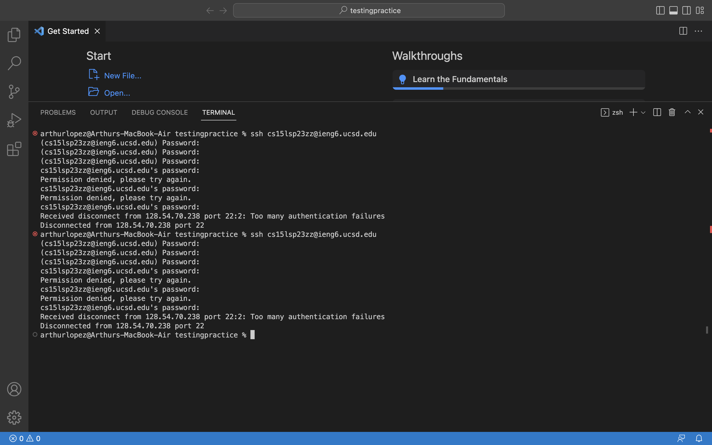
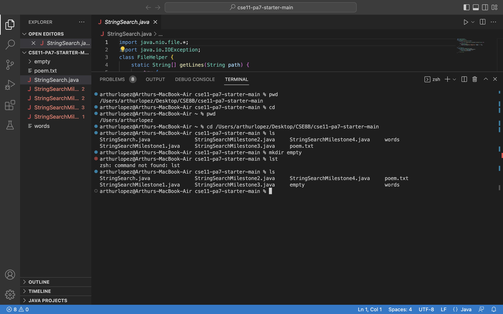

# CSE15L Report1
&nbsp;
&nbsp;
### Installing VScode

&nbsp;
The first step to installing VScode is to download the correct VScode versin for the device you are using. &nbsp;
Once it VScode is downloaded, you will need to run the installer. &nbsp;
After that, VScode should be installed into you device :)
&nbsp;
&nbsp;
&nbsp;

The action of every agent  
  into the world  
starts  
  from their physical selves.  

### Remotely Connecting

&nbsp;
&nbsp;
&nbsp;

### Trying Some Commands

